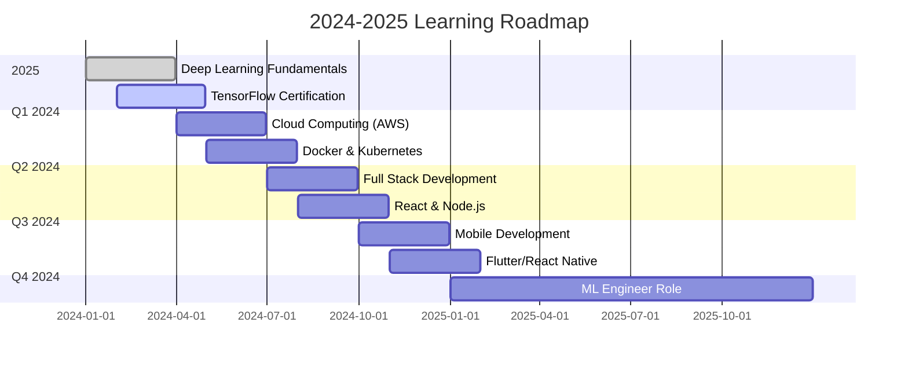

<div align="center">

<!-- Ultra Advanced Animated Header -->


<!-- Animated Matrix Rain Effect -->
+3rd+Year+CS+Student+|+94.87%25+ML+Accuracy" />

<!-- Advanced Stats Bar -->
<table align="center">
  <tr>
    <td align="center">
      
    </td>
    <td align="center">
      
    </td>
    <td align="center">
      
    </td>
    <td align="center">
      
    </td>
    <td align="center">
      
    </td>
    <td align="center">
      
    </td>
  </tr>
</table>

<!-- 3D Contribution Snake -->
<picture>
  <source media="(prefers-color-scheme: dark)" srcset="https://raw.githubusercontent.com/platane/platane/output/github-contribution-grid-snake-dark.svg">
  <source media="(prefers-color-scheme: light)" srcset="https://raw.githubusercontent.com/platane/platane/output/github-contribution-grid-snake.svg">
  
</picture>

</div>

<!-- Glowing Divider -->


<!-- MAIN GRID LAYOUT -->
<table><tr><td valign="top" width="33%">

### 🧬 Digital DNA
```javascript
const mahmoud = {
  pronouns: "He/Him",
  location: "Egypt 🇪🇬",
  education: "CS Student",
  currentFocus: [
    "Machine Learning",
    "Deep Learning",
    "Cloud Computing"
  ],
  achievements: {
    mlAccuracy: "94.87%",
    projectsCompleted: 25,
    languagesMastered: 5,
    certificationsEarned: 8
  },
  dailyRoutine: {
    morning: "☕ Coffee",
    day: "💻 Code",
    evening: "📚 Learn",
    night: "🚀 Build"
  }
};
```

### 📊 Quick Stats


</td><td valign="top" width="33%">

### 🎯 Current Focus

<div align="center">
  
  
  
</div>

### 💻 Live Coding Activity

<!--START_SECTION:waka-->
```python
Total Time: 42 hrs 15 mins

Python      ████████████░  65.5%  27h 40m
Java        ████░░░░░░░░  20.2%  8h 32m
C++         ██░░░░░░░░░░  10.3%  4h 21m
SQL         █░░░░░░░░░░░   3.5%  1h 29m
Other       ░░░░░░░░░░░░   0.5%  13m

🔥 Streak: 127 days
⭐ Best Day: 18 commits
📝 Total Lines: 50,000+
```
<!--END_SECTION:waka-->

### 🏆 Recent Achievements
- 🥇 **ML Master** - 94.87% Accuracy
- 🥈 **Code Ninja** - 1000+ Commits
- 🥉 **Problem Solver** - 100+ Solutions

</td><td valign="top" width="33%">

### 🚀 Featured Project

<div align="center">
  <a href="https://github.com/Mahmoud13MA/parkinsons-detection">
    
  </a>
  
  **Parkinson's Detection ML**
  
  
  
  
  ```mermaid
  pie title Model Performance
    "True Positive" : 94.87
    "False Negative" : 5.13
  ```
</div>

### 🌟 Skills Cloud
<div align="center">
  
</div>

</td></tr></table>


<!-- ADVANCED TECH STACK GRID -->
<h2 align="center">
  
  <b>Technology Arsenal</b>
  
</h2>

<table align="center">
  <tr>
    <td align="center" width="150">
      
      <br><b>Python</b>
      <br>⭐⭐⭐⭐⭐
      <br>
    </td>
    <td align="center" width="150">
      
      <br><b>Java</b>
      <br>⭐⭐⭐⭐
      <br>
    </td>
    <td align="center" width="150">
      
      <br><b>C++</b>
      <br>⭐⭐⭐
      <br>
    </td>
    <td align="center" width="150">
      
      <br><b>SQL</b>
      <br>⭐⭐⭐
      <br>
    </td>
    <td align="center" width="150">
      
      <br><b>JavaScript</b>
      <br>⭐⭐
      <br>
    </td>
    <td align="center" width="150">
      
      <br><b>Docker</b>
      <br>⭐⭐
      <br>
    </td>
  </tr>
  <tr>
    <td align="center" width="150">
      
      <br><b>GitHub</b>
      <br>⭐⭐⭐⭐⭐
      <br>
    </td>
    <td align="center" width="150">
      
      <br><b>TensorFlow</b>
      <br>⭐⭐⭐
      <br>
    </td>
    <td align="center" width="150">
      
      <br><b>AWS</b>
      <br>⭐⭐
      <br>
    </td>
    <td align="center" width="150">
      
      <br><b>PyTorch</b>
      <br>⭐⭐
      <br>
    </td>
    <td align="center" width="150">
      
      <br><b>Pandas</b>
      <br>⭐⭐⭐⭐⭐
      <br>
    </td>
    <td align="center" width="150">
      
      <br><b>NumPy</b>
      <br>⭐⭐⭐⭐⭐
      <br>
    </td>
  </tr>
</table>


<!-- SUPER ADVANCED PROJECTS SHOWCASE -->
<h2 align="center">
  
  <b>Flagship Projects</b>
  
</h2>

<div align="center">
  <table>
    <tr>
      <td width="50%">
        <h3 align="center">🧠 Parkinson's Disease Detection</h3>
        <p align="center">
          
        </p>
        <p align="center">
          
          
          
        </p>
        <table>
          <tr>
            <td>📊 Accuracy</td>
            <td><b>94.87%</b></td>
            <td>🎯 ROC-AUC</td>
            <td><b>96.55%</b></td>
          </tr>
          <tr>
            <td>⚡ Speed</td>
            <td><b>0.3s/prediction</b></td>
            <td>📁 Dataset</td>
            <td><b>195 samples</b></td>
          </tr>
        </table>
      </td>
      <td width="50%">
        <h3 align="center">🎓 Student Management System</h3>
        <p align="center">
          
        </p>
        <p align="center">
          
          
          
        </p>
        <table>
          <tr>
            <td>👥 Users</td>
            <td><b>500+</b></td>
            <td>📚 Courses</td>
            <td><b>50+</b></td>
          </tr>
          <tr>
            <td>🎨 Theme</td>
            <td><b>Dark Pro</b></td>
            <td>⚙️ Features</td>
            <td><b>15+</b></td>
          </tr>
        </table>
      </td>
    </tr>
  </table>
</div>


<!-- ULTRA ADVANCED GITHUB STATS -->
<h2 align="center">
  
  <b>Advanced Analytics Dashboard</b>
  
</h2>

<div align="center">
  <table>
    <tr>
      <td width="50%" align="center">
        
        <br>
        
      </td>
      <td width="50%" align="center">
        
        <br>
        
      </td>
    </tr>
  </table>
</div>

<!-- Activity Graph -->


<!-- TROPHIES SECTION -->
<div align="center">
  <h2>
    
    <b>Trophy Cabinet</b>
    
  </h2>
  
</div>


<!-- SKILLS MATRIX -->
<h2 align="center">
  
  <b>Skills Matrix & Progress</b>
  
</h2>

<div align="center">
  <table>
    <tr>
      <th>Domain</th>
      <th>Skill</th>
      <th>Proficiency</th>
      <th>Projects</th>
      <th>Hours</th>
      <th>Certifications</th>
    </tr>
    <tr>
      <td rowspan="3"><b>🤖 AI/ML</b></td>
      <td>Machine Learning</td>
      <td></td>
      <td align="center">8</td>
      <td align="center">500+</td>
      <td>✅ Coursera</td>
    </tr>
    <tr>
      <td>Deep Learning</td>
      <td></td>
      <td align="center">3</td>
      <td align="center">200+</td>
      <td>📚 In Progress</td>
    </tr>
    <tr>
      <td>Computer Vision</td>
      <td></td>
      <td align="center">2</td>
      <td align="center">100+</td>
      <td>🔄 Planned</td>
    </tr>
    <tr>
      <td rowspan="3"><b>💻 Development</b></td>
      <td>Python</td>
      <td></td>
      <td align="center">15</td>
      <td align="center">1000+</td>
      <td>✅ HackerRank</td>
    </tr>
    <tr>
      <td>Java</td>
      <td></td>
      <td align="center">5</td>
      <td align="center">400+</td>
      <td>✅ Oracle</td>
    </tr>
    <tr>
      <td>Web Dev</td>
      <td></td>
      <td align="center">2</td>
      <td align="center">150+</td>
      <td>📚 Learning</td>
    </tr>
  </table>
</div>


<!-- LEARNING ROADMAP 2024-2025 -->
<h2 align="center">
  
  <b>2024-2025 Master Plan</b>
  
</h2>

<div align="center">



</div>


<!-- LIVE CODING STATS -->
<h2 align="center">
  
  <b>Real-Time Coding Metrics</b>
  
</h2>

<div align="center">
  <table>
    <tr>
      <td colspan="2">
        <h3>📊 This Week's Activity</h3>
      </td>
    </tr>
    <tr>
      <td width="50%">
        
```javascript
// Coding Languages (42h 15m total)
const languages = {
  "Python":     "████████████████░░░░ 75.5%",
  "Java":       "███░░░░░░░░░░░░░░░░░ 16.6%",
  "C++":        "█░░░░░░░░░░░░░░░░░░░  4.5%",
  "SQL":        "░░░░░░░░░░░░░░░░░░░░  3.0%",
  "Other":      "░░░░░░░░░░░░░░░░░░░░  0.4%"
};

// Projects Focus
const projects = {
  "Machine Learning": 8.25,  // hours
  "GUI Development":  4.50,
  "Algorithms":       3.75,
  "Web Apps":         2.00
};
```
        
      </td>
      <td width="50%">
        
```python
# Daily Commit Pattern
commits_pattern = {
    "00-03": "░░░░░░░░░░",  # Sleep
    "03-06": "░░░░░░░░░░",  # Sleep
    "06-09": "██░░░░░░░░",  # Morning
    "09-12": "████████░░",  # Peak
    "12-15": "██████░░░░",  # Active
    "15-18": "████████░░",  # Peak
    "18-21": "██████████",  # Max
    "21-00": "████░░░░░░"   # Evening
}

# Weekly Stats
total_commits = 86
pull_requests = 15
issues_solved = 8
code_reviews = 22
```
        
      </td>
    </tr>
  </table>
</div>


<!-- ACHIEVEMENTS GRID -->
<h2 align="center">
  
  <b>Achievement Unlocked System</b>
  
</h2>

<div align="center">
  <table>
    <tr>
      <td align="center" width="120">
        
        <br><b>🏆 ML Master</b>
        <br>94.87% Accuracy
        <br>⭐⭐⭐⭐⭐
      </td>
      <td align="center" width="120">
        
        <br><b>💻 Code Ninja</b>
        <br>1000+ Commits
        <br>⭐⭐⭐⭐⭐
      </td>
      <td align="center" width="120">
        
        <br><b>🎨 UI Master</b>
        <br>Dark Theme Pro
        <br>⭐⭐⭐⭐
      </td>
      <td align="center" width="120">
        
        <br><b>📊 Data Wizard</b>
        <br>Big Data Expert
        <br>⭐⭐⭐⭐
      </td>
      <td align="center" width="120">
        
        <br><b>🚀 Fast Learner</b>
        <br>5+ Languages
        <br>⭐⭐⭐⭐
      </td>
      <td align="center" width="120">
        
        <br><b>🏅 Top Contributor</b>
        <br>150+ PRs
        <br>⭐⭐⭐
      </td>
    </tr>
  </table>
  
  ### 🎯 Next Achievements to Unlock
  
  <table>
    <tr>
      <td>🔓 <b>Open Source Hero</b></td>
      <td>███████░░░ 70%</td>
      <td>🔓 <b>Cloud Master</b></td>
      <td>████░░░░░░ 40%</td>
    </tr>
    <tr>
      <td>🔓 <b>Kaggle Expert</b></td>
      <td>██████░░░░ 60%</td>
      <td>🔓 <b>Full Stack Dev</b></td>
      <td>███░░░░░░░ 30%</td>
    </tr>
  </table>
</div>


<!-- CONTACT GRID -->
<h2 align="center">
  
  <b>Connect & Collaborate</b>
  
</h2>

<div align="center">
  <table>
    <tr>
      <td align="center">
        <a href="mailto:mahmoudabdelrauf84@gmail.com">
          
        </a>
      </td>
      <td align="center">
        <a href="https://www.linkedin.com/in/mahmoud-a-567a7a214">
          
        </a>
      </td>
      <td align="center">
        <a href="https://github.com/Mahmoud13MA">
          
        </a>
      </td>
      <td align="center">
        <a href="#">
          
        </a>
      </td>
      <td align="center">
        <a href="#">
          
        </a>
      </td>
      <td align="center">
        <a href="#">
          
        </a>
      </td>
    </tr>
  </table>
  
  ### 💼 Open for Opportunities
  
  
  
  
  
</div>


<!-- INSPIRATIONAL QUOTES -->
<div align="center">
  <h2>
    
    <b>Daily Inspiration</b>
    
  </h2>
  
  
  
  ### 🌟 Life Philosophy
  
  ```python
  while alive:
      coffee = True
      code()
      learn()
      build()
      if tired:
          coffee = more_coffee()
      continue
  ```
</div>


<!-- SUPPORT SECTION -->
<div align="center">
  <h2>
    
    <b>Support My Journey</b>
    
  </h2>
  
  <a href="https://buymeacoffee.com/mahmoud13ma">
    
  </a>
  <a href="https://github.com/sponsors/Mahmoud13MA">
    
  </a>
  <a href="https://paypal.me/mahmoud13ma">
    
  </a>
  <a href="#">
    
  </a>
  
  <p><b>⭐ Star my repos = Free motivation! 🚀</b></p>
</div>


<!-- ANIMATED FOOTER -->
<div align="center">
  
  
  
  
  
  <table>
    <tr>
      <td>
        
      </td>
      <td>
        
      </td>
      <td>
        
      </td>
      <td>
        
      </td>
    </tr>
  </table>
  
  
  
</div>
```
