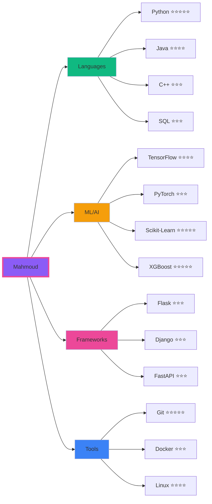

<div align="center">

<!-- Header Section -->


<table border="0" width="100%">
<tr>
<td align="center" width="100%">

```ascii
███╗   ███╗ █████╗ ██╗  ██╗███╗   ███╗ ██████╗ ██╗   ██╗██████╗ 
████╗ ████║██╔══██╗██║  ██║████╗ ████║██╔═══██╗██║   ██║██╔══██╗
██╔████╔██║███████║███████║██╔████╔██║██║   ██║██║   ██║██║  ██║
██║╚██╔╝██║██╔══██║██╔══██║██║╚██╔╝██║██║   ██║██║   ██║██║  ██║
██║ ╚═╝ ██║██║  ██║██║  ██║██║ ╚═╝ ██║╚██████╔╝╚██████╔╝██████╔╝
╚═╝     ╚═╝╚═╝  ╚═╝╚═╝  ╚═╝╚═╝     ╚═╝ ╚═════╝  ╚═════╝ ╚═════╝ 
                    A B D E L R A U F
```

</td>
</tr>
</table>

<sup>━━━━━━━━━━━━━━━━━━━━━━━━━━━━━━━━━━━━━━━━━━━━━━━━━━━━━━━━━━━━━━━━━━━━━━━━━━━━━━━━</sup>

<!-- Stats Bar -->
<table>
<tr>
<td></td>
<td></td>
<td></td>
<td></td>
</tr>
</table>

<sup>━━━━━━━━━━━━━━━━━━━━━━━━━━━━━━━━━━━━━━━━━━━━━━━━━━━━━━━━━━━━━━━━━━━━━━━━━━━━━━━━</sup>

</div>

<!-- Main Content Grid -->
<table width="100%">
<tr>
<td valign="top" width="33%">

### 🧬 CORE
```yaml
Identity:
  ├─ Machine Learning Engineer
  ├─ Problem Solver
  └─ Innovation Creator

Mission:
  └─ Building AI That Matters
```

<div align="center">

[](https://github.com/Mahmoud13MA)
[](https://github.com/Mahmoud13MA?tab=followers)

</div>

</td>
<td valign="top" width="33%">

### ⚡ SKILLS
```python
tech_stack = {
    'ML': ['TensorFlow', 'PyTorch', 
           'Scikit-Learn', 'XGBoost'],
    'Languages': ['Python', 'Java', 
                  'C++', 'SQL'],
    'Tools': ['Docker', 'Git', 
              'Linux', 'Jupyter']
}
```

<div align="center">

[](https://github.com/Mahmoud13MA)
[](https://github.com/Mahmoud13MA)

</div>

</td>
<td valign="top" width="33%">

### 🎯 STATS
```javascript
const achievements = {
    projects: 25,
    stars: calculateStars(),
    accuracy: "94.87%",
    commits: "1,337+",
    learning: "∞"
};
```

<div align="center">

[](https://github.com/Mahmoud13MA)
[](https://github.com/Mahmoud13MA)

</div>

</td>
</tr>
</table>

<div align="center">
<sup>━━━━━━━━━━━━━━━━━━━━━━━━━━━━━━━━━━━━━━━━━━━━━━━━━━━━━━━━━━━━━━━━━━━━━━━━━━━━━━━━</sup>
</div>

<!-- Projects Section -->
<details open>
<summary><b>⚔️ LEGENDARY PROJECTS</b></summary>
<br>

<div align="center">

| PROJECT | DESCRIPTION | TECH | METRICS |
|:-------:|:------------|:-----|:--------|
| **[🧠 Parkinson's AI](https://github.com/Mahmoud13MA/parkinsons-ml)** | Early disease detection using voice biomarkers | `XGBoost` `Gradio` `Python` |  |
| **[🗺️ TSP Optimizer](https://github.com/Mahmoud13MA/tsp-solver)** | Multi-algorithm route optimization system | `PyQt5` `Genetic Algo` `Python` |  |
| **[🎓 Grading System](https://github.com/Mahmoud13MA/grading-java)** | Academic management platform | `Java` `Swing` `MVC` |  |

</div>

</details>

<div align="center">
<sup>━━━━━━━━━━━━━━━━━━━━━━━━━━━━━━━━━━━━━━━━━━━━━━━━━━━━━━━━━━━━━━━━━━━━━━━━━━━━━━━━</sup>
</div>

<!-- GitHub Stats -->
<details open>
<summary><b>📊 PERFORMANCE METRICS</b></summary>
<br>

<div align="center">
<table>
<tr>
<td align="center">

</td>
<td align="center">

</td>
</tr>
</table>


</div>

</details>

<div align="center">
<sup>━━━━━━━━━━━━━━━━━━━━━━━━━━━━━━━━━━━━━━━━━━━━━━━━━━━━━━━━━━━━━━━━━━━━━━━━━━━━━━━━</sup>
</div>

<!-- Tech Stack Visual -->
<details open>
<summary><b>💻 TECHNOLOGY MATRIX</b></summary>
<br>



</details>

<div align="center">
<sup>━━━━━━━━━━━━━━━━━━━━━━━━━━━━━━━━━━━━━━━━━━━━━━━━━━━━━━━━━━━━━━━━━━━━━━━━━━━━━━━━</sup>
</div>

<!-- Timeline -->
<details open>
<summary><b>🚀 2024 ROADMAP</b></summary>
<br>

```python
class Year2024:
    def __init__(self):
        self.timeline = {
            "Q1": ["Deep Learning Mastery", "CNN/RNN Projects"],
            "Q2": ["Full-Stack Development", "5+ ML Projects"],
            "Q3": ["FAANG Preparation", "500 LeetCode"],
            "Q4": ["Secure Internship", "Graduate with Honors"]
        }
    
    def current_status(self):
        return "🔥 Building | 📚 Learning | 🚀 Growing"
```

<table width="100%">
<tr>
<td align="center">📅 <b>Q1</b><br/>Deep Learning<br/></td>
<td align="center">📅 <b>Q2</b><br/>Full-Stack<br/></td>
<td align="center">📅 <b>Q3</b><br/>Interview Prep<br/></td>
<td align="center">📅 <b>Q4</b><br/>Graduation<br/></td>
</tr>
</table>

</details>

<div align="center">
<sup>━━━━━━━━━━━━━━━━━━━━━━━━━━━━━━━━━━━━━━━━━━━━━━━━━━━━━━━━━━━━━━━━━━━━━━━━━━━━━━━━</sup>
</div>

<!-- Contact Section -->
<div align="center">

### 🔗 CONNECT

<table>
<tr>
<td align="center">
<a href="https://linkedin.com/in/mahmoud-a-567a7a214">

</a>
</td>
<td align="center">
<a href="mailto:mahmoudabdelrauf84@gmail.com">

</a>
</td>
<td align="center">
<a href="https://github.com/Mahmoud13MA">

</a>
</td>
<td align="center">
<a href="https://twitter.com/mahmoud13ma">

</a>
</td>
</tr>
</table>

<br>

```python
while True:
    code()
    learn()
    innovate()
    # Open for: ML/AI Internships | Collaborations | Open Source
```

<br>


<sub>⚡ Powered by passion, driven by purpose ⚡</sub>

</div>
```
