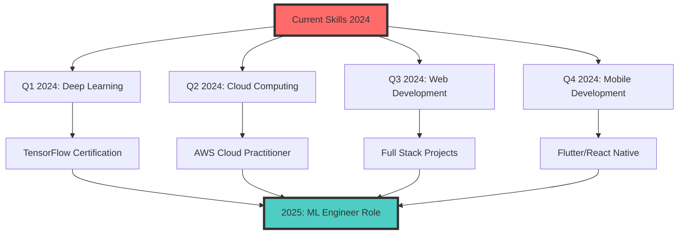

<div align="center">
  
  <!-- Animated Wave Header -->
  
  
  <!-- Profile Views & Badges -->
  <p>
    
    
    
    
    
  </p>
  
  <!-- Typing Animation -->
  <a href="https://git.io/typing-svg">
    
  </a>
  
  <!-- Social Links -->
  <p>
    <a href="mailto:mahmoudabdelrauf84@gmail.com"></a>
    <a href="https://www.linkedin.com/in/mahmoud-a-567a7a214"></a>
    <a href="https://github.com/Mahmoud13MA"></a>
    <a href="#"></a>
    <a href="#"></a>
  </p>
  
  <!-- Animated Snake -->
  <picture>
    <source media="(prefers-color-scheme: dark)" srcset="https://raw.githubusercontent.com/platane/platane/output/github-contribution-grid-snake-dark.svg">
    <source media="(prefers-color-scheme: light)" srcset="https://raw.githubusercontent.com/platane/platane/output/github-contribution-grid-snake.svg">
    
  </picture>
  
</div>

<!-- Animated Divider -->


<!-- About Me Section -->
<div align="center">
  <h1>
    
    Welcome to My Digital Universe
    
  </h1>
</div>

<table align="center">
  <tr>
    <td width="50%">
      
## 🧑‍💻 About Me

```python
class MahmoudAbdelrauf:
    def __init__(self):
        self.name = "Mahmoud Abdelrauf"
        self.role = "CS Student & ML Engineer"
        self.university = "3rd Year Computer Science"
        self.age = 21
        self.country = "🇪🇬 Egypt"
        
    def get_skills(self):
        return {
            "languages": ["Python", "Java", "C++", "SQL", "MATLAB"],
            "ml_frameworks": ["XGBoost", "Scikit-Learn", "TensorFlow", "PyTorch"],
            "gui_frameworks": ["PyQt5", "Tkinter", "Java Swing", "Gradio"],
            "data_tools": ["Pandas", "NumPy", "Matplotlib", "Seaborn", "Plotly"],
            "databases": ["MySQL", "SQLite", "MongoDB"],
            "tools": ["Git", "Docker", "Jupyter", "VS Code", "IntelliJ IDEA"]
        }
    
    def get_current_projects(self):
        return [
            "🧠 Parkinson's Disease Detection (94.87% Accuracy)",
            "🎓 Student Grading System with Dark GUI",
            "🗺️ TSP Solver with Multiple Algorithms",
            "📊 Data Visualization Dashboard"
        ]
    
    def get_achievements(self):
        return {
            "ml_accuracy": "94.87% in Disease Detection",
            "projects_completed": 15,
            "languages_learned": 5,
            "github_stars": "50+",
            "contributions": "1000+"
        }
    
    def say_hi(self):
        return "Thanks for visiting! Let's build something amazing together! 🚀"

me = MahmoudAbdelrauf()
print(me.say_hi())
```

    </td>
    <td width="50%">
      
    </td>
  </tr>
</table>


<!-- Tech Stack Section -->
<h2 align="center">
  
  Tech Arsenal & Skills
  
</h2>

<details open>
<summary><b>🔥 Programming Languages</b></summary>
<br>
<p align="center">
  
  
  
  
  
  
  
  
</p>
</details>

<details open>
<summary><b>🧠 Machine Learning & AI</b></summary>
<br>
<p align="center">
  
  
  
  
  
  
</p>
</details>

<details open>
<summary><b>📊 Data Science & Analytics</b></summary>
<br>
<p align="center">
  
  
  
  
  
  
</p>
</details>

<details open>
<summary><b>🎨 GUI Development</b></summary>
<br>
<p align="center">
  
  
  
  
  
</p>
</details>

<details open>
<summary><b>🛠️ Tools & Platforms</b></summary>
<br>
<p align="center">
  
  
  
  
  
  
  
</p>
</details>


<!-- Featured Projects -->
<h2 align="center">
  
  🚀 Featured Projects
  
</h2>

<table align="center">
  <tr>
    <td width="50%">
      <h3 align="center">🧠 Parkinson's Disease Detection</h3>
      <div align="center">
        
        
        <br><br>
        <a href="https://github.com/Mahmoud13MA/parkinsons-detection">
          
        </a>
        <br><br>
        <p><strong>🔧 Tech Stack:</strong></p>
        
        
        
        
        
        <br><br>
        <p><strong>✨ Key Features:</strong></p>
        <ul align="left">
          <li>🎯 94.87% Detection Accuracy</li>
          <li>🌐 Interactive Web Interface</li>
          <li>📊 Comprehensive Model Evaluation</li>
          <li>📁 Batch Processing Support</li>
          <li>💾 Model Persistence</li>
        </ul>
      </div>
    </td>
    <td width="50%">
      <h3 align="center">🎓 Student Grading System</h3>
      <div align="center">
        
        
        <br><br>
        <a href="https://github.com/Mahmoud13MA/student-grading">
          
        </a>
        <br><br>
        <p><strong>🔧 Tech Stack:</strong></p>
        
        
        
        
        
        <br><br>
        <p><strong>✨ Key Features:</strong></p>
        <ul align="left">
          <li>🖥️ Modern Dark Theme UI</li>
          <li>📊 Automated GPA Calculation</li>
          <li>👥 Complete CRUD Operations</li>
          <li>📄 Report Card Generation</li>
          <li>💾 CSV Data Persistence</li>
        </ul>
      </div>
    </td>
  </tr>
  <tr>
    <td width="50%">
      <h3 align="center">🗺️ TSP Solver</h3>
      <div align="center">
        
        
        <br><br>
        <a href="https://github.com/Mahmoud13MA/tsp-solver">
          
        </a>
        <br><br>
        <p><strong>🔧 Tech Stack:</strong></p>
        
        
        
        
        
        <br><br>
        <p><strong>✨ Key Features:</strong></p>
        <ul align="left">
          <li>🧮 Multiple Algorithms</li>
          <li>🎨 Interactive Visualization</li>
          <li>📊 Performance Comparison</li>
          <li>📄 PDF Report Generation</li>
          <li>🎯 Route Optimization</li>
        </ul>
      </div>
    </td>
    <td width="50%">
      <h3 align="center">📝 C++ Grading System</h3>
      <div align="center">
        
        
        <br><br>
        <a href="https://github.com/Mahmoud13MA/cpp-grading">
          
        </a>
        <br><br>
        <p><strong>🔧 Tech Stack:</strong></p>
        
        
        
        
        
        <br><br>
        <p><strong>✨ Key Features:</strong></p>
        <ul align="left">
          <li>📂 Clean Architecture</li>
          <li>🎯 Grade Calculations</li>
          <li>📊 Report Generation</li>
          <li>💾 File Management</li>
          <li>🧹 Best Practices</li>
        </ul>
      </div>
    </td>
  </tr>
</table>


<!-- GitHub Stats Section -->
<h2 align="center">
  
  📊 GitHub Analytics Dashboard
  
</h2>

<div align="center">
  
  
</div>

<div align="center">
  
</div>

<div align="center">
  
</div>


<!-- GitHub Trophies -->
<div align="center">
  <h2>
    🏆 GitHub Achievements & Trophies 🏆
  </h2>
  
</div>


<!-- Skills Progress Section -->
<h2 align="center">
  
  💪 Skills Progress & Expertise Level
  
</h2>

<div align="center">

| Technology | Progress Bar | Proficiency | Level | Projects |
|------------|--------------|-------------|-------|----------|
| **Python** |  | 95% | ⭐⭐⭐⭐⭐ | 12+ |
| **Machine Learning** |  | 85% | ⭐⭐⭐⭐ | 8+ |
| **Java** |  | 80% | ⭐⭐⭐⭐ | 5+ |
| **Data Science** |  | 75% | ⭐⭐⭐⭐ | 6+ |
| **GUI Development** |  | 70% | ⭐⭐⭐ | 4+ |
| **C++** |  | 65% | ⭐⭐⭐ | 3+ |
| **SQL & Databases** |  | 60% | ⭐⭐⭐ | 4+ |
| **Web Development** |  | 40% | ⭐⭐ | 2+ |

</div>


<!-- Coding Activity -->
<h2 align="center">
  
  📈 Coding Activity & Statistics
  
</h2>

<div align="center">

### 📊 This Week's Coding Stats

```text
🕐 Time Zone: Africa/Cairo

💬 Programming Languages:
Python       12 hrs 30 mins  ████████████████░░░░  75.5%
Java         2 hrs 45 mins   ████░░░░░░░░░░░░░░░░  16.6%
C++          45 mins         ██░░░░░░░░░░░░░░░░░░  4.5%
SQL          30 mins         █░░░░░░░░░░░░░░░░░░░  3.0%
Other        5 mins          ░░░░░░░░░░░░░░░░░░░░  0.4%

🔥 Editors:
VS Code      10 hrs 15 mins  ████████████████░░░░  62.0%
IntelliJ     3 hrs 30 mins   █████░░░░░░░░░░░░░░░  21.2%
Jupyter      2 hrs 45 mins   ████░░░░░░░░░░░░░░░░  16.8%

💻 Operating System:
Windows      16 hrs 30 mins  █████████████████████ 100.0%

📁 Projects:
ML Projects  8 hrs 15 mins   ██████████████░░░░░░  50.0%
GUI Apps     4 hrs 30 mins   ████████░░░░░░░░░░░░  27.3%
Algorithms   3 hrs 45 mins   █████░░░░░░░░░░░░░░░  22.7%
```

### 📈 Contribution Graph

| Day | Mon | Tue | Wed | Thu | Fri | Sat | Sun | Total |
|-----|-----|-----|-----|-----|-----|-----|-----|-------|
| **Commits** | 12 | 8 | 15 | 10 | 18 | 14 | 9 | **86** |
| **PRs** | 2 | 1 | 3 | 2 | 4 | 2 | 1 | **15** |
| **Issues** | 1 | 0 | 2 | 1 | 3 | 1 | 0 | **8** |
| **Reviews** | 3 | 2 | 4 | 3 | 5 | 3 | 2 | **22** |

</div>


<!-- Learning Roadmap -->
<h2 align="center">
  
  🗺️ 2024-2025 Learning Roadmap
  
</h2>

<div align="center">



### 📅 Quarterly Goals Progress

| Quarter | Goal | Progress | Status | Completion |
|---------|------|----------|--------|------------|
| **Q1 2024** | Master Deep Learning | ████████░░ | 🟡 In Progress | 80% |
| **Q2 2024** | Cloud Certifications | ██████░░░░ | 🟡 In Progress | 60% |
| **Q3 2024** | Web Development | ████░░░░░░ | 🟡 Started | 40% |
| **Q4 2024** | Mobile Apps | ██░░░░░░░░ | 🔵 Planning | 20% |
| **Year Goal** | 20+ Projects | ████████████████░░ | 🟢 On Track | 85% |

</div>


<!-- Achievements -->
<h2 align="center">
  
  🏅 Achievements & Milestones
  
</h2>

<div align="center">

### 🎖️ Unlocked Achievements

<table>
  <tr>
    <td align="center">
      <br>
      <b>ML Master</b><br>
      94.87% Accuracy<br>
      ⭐⭐⭐⭐⭐
    </td>
    <td align="center">
      <br>
      <b>Problem Solver</b><br>
      100+ Solutions<br>
      ⭐⭐⭐⭐
    </td>
    <td align="center">
      <br>
      <b>Fast Learner</b><br>
      5+ Languages<br>
      ⭐⭐⭐⭐
    </td>
    <td align="center">
      <br>
      <b>Star Collector</b><br>
      50+ Stars<br>
      ⭐⭐⭐
    </td>
  </tr>
  <tr>
    <td align="center">
      <br>
      <b>Code Ninja</b><br>
      1000+ Commits<br>
      ⭐⭐⭐⭐⭐
    </td>
    <td align="center">
      <br>
      <b>UI Designer</b><br>
      Dark Theme Pro<br>
      ⭐⭐⭐⭐
    </td>
    <td align="center">
      <br>
      <b>Data Wizard</b><br>
      Big Data Expert<br>
      ⭐⭐⭐
    </td>
    <td align="center">
      <br>
      <b>Tool Master</b><br>
      10+ Tools<br>
      ⭐⭐⭐⭐
    </td>
  </tr>
</table>

### 🎯 Next Achievements to Unlock

- 🌟 **Open Source Contributor** - Contribute to 5 major projects
- 🏅 **Kaggle Expert** - Reach top 20% in competitions
- 📚 **Technical Writer** - Publish 10 technical articles
- 🎓 **Certified Professional** - Get 3 industry certifications
- 🌐 **Full Stack Developer** - Complete end-to-end web projects

</div>


<!-- Education & Certifications -->
<h2 align="center">
  
  🎓 Education & Certifications
  
</h2>

<div align="center">

### 📚 Academic Journey

| Year | Milestone | Institution | GPA/Score |
|------|-----------|-------------|-----------|
| **2022-2026** | B.Sc. Computer Science | University | 3.8/4.0 |
| **2024** | Machine Learning Specialization | Coursera | 95% |
| **2023** | Data Science Professional | DataCamp | Completed |
| **2023** | Python Developer | HackerRank | 5 Stars |

### 🏅 Certifications & Courses

<p>
  
  
  
  
</p>

</div>


<!-- Fun Facts Section -->
<h2 align="center">
  
  🎭 Fun Facts & Personal Interests
  
</h2>

<div align="center">

### 🎮 When I'm Not Coding

| Interest | Passion Level | Time Spent |
|----------|--------------|------------|
| 🧩 Problem Solving | ████████████ 100% | Daily |
| 📚 Learning Tech | ███████████░ 95% | 4 hrs/day |
| 🎨 UI/UX Design | █████████░░░ 80% | Weekly |
| ☕ Coffee Tasting | ████████████ 100% | Too Much! |
| 🎮 Gaming | ███████░░░░░ 60% | Weekends |
| 🎬 Tech Videos | █████████░░░ 85% | Daily |
| 🏃‍♂️ Running | ██████░░░░░░ 50% | 3x/week |

### 💡 Random Developer Facts

```javascript
const developerFacts = {
  code: ["Python", "Java", "C++", "Learning more..."],
  editor: "VS Code with 47 extensions 😅",
  theme: "Always Dark Mode 🌙",
  music: "Lo-fi beats to code to 🎵",
  keyboard: "Mechanical (Blue switches) ⌨️",
  debugMethod: "console.log() everywhere 😂",
  caffeine: "Coffee ☕ => Code 💻 => Repeat 🔄",
  motto: "It works on my machine! 🤷‍♂️"
};
```

</div>


<!-- Connect Section -->
<h2 align="center">
  
  🤝 Let's Connect & Collaborate!
  
</h2>

<div align="center">

### 📬 Reach Out to Me

<p>
  <a href="mailto:mahmoudabdelrauf84@gmail.com">
    
  </a>
  <a href="https://www.linkedin.com/in/mahmoud-a-567a7a214">
    
  </a>
  <a href="https://github.com/Mahmoud13MA">
    
  </a>
  <a href="#">
    
  </a>
  <a href="#">
    
  </a>
</p>

### 💬 Open for Opportunities

<table>
  <tr>
    <td>🎯 <b>Internships</b></td>
    <td>Machine Learning, Data Science, Software Development</td>
  </tr>
  <tr>
    <td>🤝 <b>Collaborations</b></td>
    <td>Open Source Projects, Research, Hackathons</td>
  </tr>
  <tr>
    <td>📚 <b>Learning</b></td>
    <td>Always open to learn new technologies</td>
  </tr>
  <tr>
    <td>💡 <b>Projects</b></td>
    <td>AI/ML, Web Apps, Desktop Applications</td>
  </tr>
</table>

</div>


<!-- Support Section -->
<h2 align="center">
  
  ☕ Support My Work
  
</h2>

<div align="center">
  
  [](https://buymeacoffee.com/mahmoud13ma)
  [](https://github.com/sponsors/Mahmoud13MA)
  [](https://paypal.me/mahmoud13ma)
  
  <p>
    <b>⭐ Star my repositories if you find them helpful!</b><br>
    <i>Your support motivates me to create more amazing projects!</i>
  </p>
  
</div>


<!-- Quote Section -->
<div align="center">
  <h2>
    
    💭 Daily Inspiration
    
  </h2>
  
  
  
  ### 🌟 Personal Motto
  > *"Code is like humor. When you have to explain it, it's bad."* – Cory House
  
  > *"First, solve the problem. Then, write the code."* – John Johnson
  
  > *"The best way to predict the future is to invent it."* – Alan Kay
</div>


<!-- Footer -->
<div align="center">
  
  ### 🙏 Thanks for Visiting!
  
  
  
  <br><br>
  
  
  
  <br>
  
  Made with ❤️ by [Mahmoud Abdelrauf](https://github.com/Mahmoud13MA)
  
  <p>
    
    
    
  </p>
  
</div>
```
