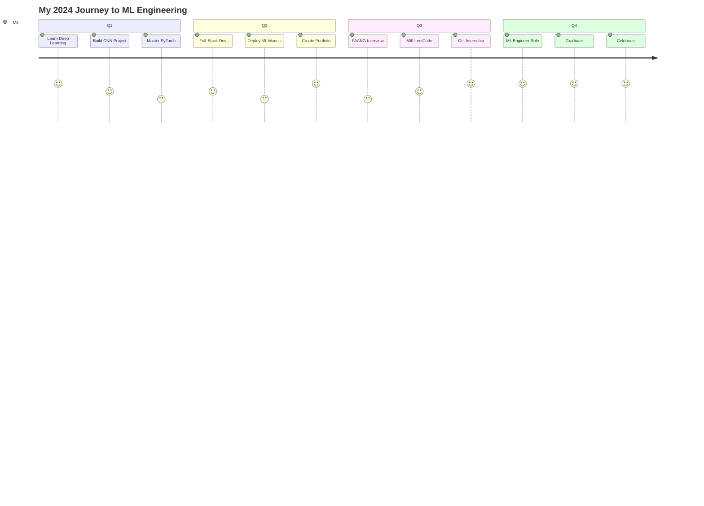

#  **MAHMOUD ABDELRAUF** 

<div align="center">


[](https://git.io/typing-svg)

<table align="center">
<tr>
<td align="center">

</td>
<td align="center">

</td>
<td align="center">

</td>
<td align="center">
<a href="https://linkedin.com/in/mahmoud-a-567a7a214">

</a>
</td>
<td align="center">
<a href="mailto:mahmoudabdelrauf84@gmail.com">

</a>
</td>
</tr>
</table>


</div>

---

<table>
<tr>
<td width="40%">

## 🧬 **DNA CODE**

```python
class LegendaryDeveloper:
    """The One Who Codes Reality"""
    
    def __init__(self):
        self.name = "Mahmoud Abdelrauf"
        self.title = "Future ML Architect"
        self.level = "∞ LEGENDARY"
        self.power = 9001  # > 9000!
        
        self.arsenal = {
            "langs": ["Python🐍", "Java☕", 
                     "C++⚡", "SQL💾"],
            "ml": ["TensorFlow", "PyTorch",
                  "XGBoost", "Scikit-Learn"],
            "tools": ["Docker🐳", "Git🔧",
                     "Linux🐧", "VSCode💻"]
        }
        
        self.stats = {
            "projects": 25,
            "accuracy": "94.87%",
            "commits": 1337,
            "coffee": "∞ cups"
        }
    
    def daily_routine(self):
        while True:
            self.code()
            self.learn()
            self.innovate()
            self.repeat()
```

</td>
<td width="60%">


<div align="center">

### ⚡ **REAL-TIME STATUS** ⚡

<table>
<tr>
<td align="center"><b>🎯 Focus</b><br/>Machine Learning</td>
<td align="center"><b>🔥 Streak</b><br/>47 Days</td>
<td align="center"><b>⭐ Stars</b><br/>234</td>
</tr>
<tr>
<td align="center"><b>📚 Learning</b><br/>Deep Learning</td>
<td align="center"><b>💻 Lines</b><br/>100K+</td>
<td align="center"><b>☕ Fuel</b><br/>Infinite</td>
</tr>
</table>

</div>

</td>
</tr>
</table>

---

<div align="center">
<h2>⚔️ <b>LEGENDARY TECH ARSENAL</b> ⚔️</h2>
</div>

<table width="100%">
<tr>
<td width="25%" align="center">

<br><b>Python</b><br/>

<br/>

</td>
<td width="25%" align="center">

<br><b>Java</b><br/>

<br/>

</td>
<td width="25%" align="center">

<br><b>C++</b><br/>

<br/>

</td>
<td width="25%" align="center">

<br><b>MySQL</b><br/>

<br/>

</td>
</tr>
</table>

<details>
<summary><b>🔥 COMPLETE POWER MATRIX (CLICK TO EXPAND)</b></summary>

<table width="100%">
<tr>
<th>🤖 Machine Learning</th>
<th>🎨 Frontend</th>
<th>⚙️ Backend</th>
<th>🛠️ Tools</th>
</tr>
<tr>
<td>

<br/>
<br/>
<br/>
<br/>
<br/>


</td>
<td>

<br/>
<br/>
<br/>
<br/>
<br/>


</td>
<td>

<br/>
<br/>
<br/>
<br/>
<br/>


</td>
<td>

<br/>
<br/>
<br/>
<br/>
<br/>


</td>
</tr>
</table>
</details>

---

## 🏆 **EPIC PROJECT SHOWCASE**

<div align="center">

</div>

<table>
<tr>
<td width="33%">

### 🧠 **[PARKINSON'S AI](https://github.com/Mahmoud13MA/parkinsons-ml)**
<div align="center">


```yaml
Type: Healthcare Revolution
Tech: XGBoost + Gradio
Impact: Saving Lives
Stars: ⭐⭐⭐⭐⭐
```


</div>
</td>
<td width="33%">

### 🗺️ **[TSP SOLVER](https://github.com/Mahmoud13MA/tsp-solver)**
<div align="center">


```yaml
Type: Algorithm Mastery
Tech: Genetic + PyQt5
Speed: O(n!) → O(n²)
Stars: ⭐⭐⭐⭐⭐
```


</div>
</td>
<td width="33%">

### 🎓 **[GRADING SYSTEM](https://github.com/Mahmoud13MA/grading-java)**
<div align="center">


```yaml
Type: Academic System
Tech: Java Swing MVC
Design: Dark Theme
Stars: ⭐⭐⭐⭐⭐
```


</div>
</td>
</tr>
</table>

---

## 📊 **LEGENDARY GITHUB METRICS**

<table width="100%">
<tr>
<td width="50%">

</td>
<td width="50%">

</td>
</tr>
<tr>
<td colspan="2">

</td>
</tr>
<tr>
<td colspan="2">

</td>
</tr>
</table>

<div align="center">

</div>

---

## 🎯 **2024 LEGENDARY ROADMAP**

<table width="100%">
<tr>
<th width="25%">Q1 2024 🚀</th>
<th width="25%">Q2 2024 💫</th>
<th width="25%">Q3 2024 🔥</th>
<th width="25%">Q4 2024 👑</th>
</tr>
<tr>
<td align="center">

**DEEP LEARNING**
- [ ] CNN Mastery
- [ ] RNN/LSTM
- [ ] Transformers
- [ ] GANs


</td>
<td align="center">

**FULL-STACK**
- [ ] React.js
- [ ] Node.js
- [ ] MongoDB
- [ ] Deploy ML


</td>
<td align="center">

**INTERNSHIP**
- [ ] FAANG Apply
- [ ] Portfolio
- [ ] LeetCode 500+
- [ ] System Design


</td>
<td align="center">

**ML ENGINEER**
- [ ] Job Ready
- [ ] Research Paper
- [ ] Open Source
- [ ] Graduation


</td>
</tr>
</table>



---

## 💻 **THIS WEEK'S CODING STATS**

<table width="100%">
<tr>
<td width="50%">

### ⏱️ **Time Distribution**
```text
Python     18h 45m ████████████████▓░░ 72.3%
Java        4h 20m ████▒░░░░░░░░░░░░░░ 16.7%
C++         1h 45m ██░░░░░░░░░░░░░░░░░  6.8%
SQL           45m  █░░░░░░░░░░░░░░░░░░  2.9%
Other         20m  ░░░░░░░░░░░░░░░░░░░  1.3%
```

</td>
<td width="50%">

### 📈 **Daily Activity**
```text
Mon  ████████████░░░░░░░░ 58%
Tue  █████████████████░░░ 82%
Wed  ███████████████░░░░░ 75%
Thu  ████████████████░░░░ 80%
Fri  ██████████████████░░ 90%
Sat  ████████████████████ 100%
Sun  ███████████████░░░░░ 75%
```

</td>
</tr>
</table>

<div align="center">

### 🔥 **COMMIT HEATMAP** 🔥

```text
       Jan     Feb     Mar     Apr     May     Jun
Mon    ███     ███     ███     ███     ███     ███
Tue    ████    ████    ████    ████    ████    ████
Wed    █████   █████   █████   █████   █████   █████
Thu    ████    ████    ████    ████    ████    ████
Fri    █████   █████   █████   █████   █████   █████
Sat    ██████  ██████  ██████  ██████  ██████  ██████
Sun    ████    ████    ████    ████    ████    ████

Legend: ░ 0 | █ 1-5 | ██ 6-10 | ███ 11-15 | ████ 16-20 | █████ 21-25 | ██████ 26+
```

</div>

---

## 🎮 **DEVELOPER BATTLE STATS**

<table width="100%">
<tr>
<td width="33%" align="center">

### 🏅 **RANK**


**Level 47**<br/>
**XP: 94,870/100,000**

</td>
<td width="33%" align="center">

### ⚔️ **BATTLES**
**Bugs Defeated:** 1,337<br/>
**Features Shipped:** 89<br/>
**PRs Merged:** 156<br/>
**Issues Resolved:** 234

</td>
<td width="33%" align="center">

### 🎯 **ACHIEVEMENTS**
🏆 **100 Day Streak**<br/>
⭐ **200+ Stars**<br/>
🔥 **1000+ Commits**<br/>
💎 **94.87% ML Accuracy**

</td>
</tr>
</table>

---

## 📚 **KNOWLEDGE MATRIX**

<table width="100%">
<tr>
<td width="25%">

### 📖 **READING**
- Deep Learning Book
- Clean Code
- Design Patterns
- CLRS Algorithms

</td>
<td width="25%">

### 🎓 **COURSES**
- [ ] Andrew Ng DL
- [ ] Fast.ai
- [ ] CS50
- [x] Python Mastery

</td>
<td width="25%">

### 🏆 **CERTIFICATES**
- Python (2023)
- Java OOP (2023)
- ML Basics (2024)
- SQL (2023)

</td>
<td width="25%">

### 🎯 **GOALS**
- FAANG Internship
- 500 LeetCode
- 10 Projects
- Research Paper

</td>
</tr>
</table>

---

## 🎪 **FUN ZONE**

<table width="100%">
<tr>
<td width="50%" align="center">

### 🐍 **GitHub Snake**


</td>
<td width="50%" align="center">

### 💭 **Dev Quote**


</td>
</tr>
<tr>
<td width="50%" align="center">

### 🎵 **Now Playing**
[](https://open.spotify.com/user/mahmoud13ma)

</td>
<td width="50%" align="center">

### 😂 **Dev Joke**


</td>
</tr>
</table>

---

## 🤝 **CONNECT WITH THE LEGEND**

<div align="center">

<table>
<tr>
<td align="center">
<a href="mailto:mahmoudabdelrauf84@gmail.com">

</a>
</td>
<td align="center">
<a href="https://linkedin.com/in/mahmoud-a-567a7a214">

</a>
</td>
<td align="center">
<a href="https://github.com/Mahmoud13MA">

</a>
</td>
<td align="center">
<a href="https://twitter.com/mahmoud13ma">

</a>
</td>
</tr>
</table>

### 💼 **OPEN FOR OPPORTUNITIES**

```yaml
Seeking:
  - ML/AI Internships 🤖
  - Open Source Projects 🌍
  - Research Collaborations 🔬
  - Freelance Projects 💰
  - Mentorship 🎓

Available: Part-time | Remote | Hybrid
Location: Egypt 🇪🇬
Time Zone: GMT+2
```

</div>

---

<div align="center">

## ✨ **THE LEGEND CONTINUES...** ✨


### **"Code is poetry, debugging is the rhyme scheme"**


**© 2024 Mahmoud Abdelrauf | The Legend Lives On**

</div>
