#  &nbsp; **Mahmoud Abdelrauf** | محمود عبدالرؤو٠&nbsp;

<div align="center">
  
  <!-- Animated Header -->
  
  
  <!-- Typing Animation -->
  [](https://git.io/typing-svg)
  
  <!-- Social Badges -->
  [](https://github.com/Mahmoud13MA?tab=followers)
  [](https://github.com/Mahmoud13MA)
  [](https://www.linkedin.com/in/mahmoud-a-567a7a214)
  [](mailto:mahmoudabdelrauf84@gmail.com)
  
  
  <!-- Matrix Rain Effect GIF -->
  
  
</div>

---

##  **The Legend Behind The Code**


```python
class EliteDeveloper:
    """🔥 The One Who Codes The Future 🔥"""
    
    def __init__(self):
        self.username = "Mahmoud13MA"
        self.name = "Mahmoud Abdelrauf"
        self.role = "Future ML Engineer"
        self.level = "LEGENDARY"
        self.power_level = 9001  # It's over 9000!
        
        self.skills = {
            "languages": ["Python 🐍", "Java ☕", "C++ ⚡", "SQL 💾"],
            "ml_frameworks": ["TensorFlow", "PyTorch", "Scikit-Learn", "XGBoost"],
            "specialties": ["Neural Networks", "Computer Vision", "NLP"],
            "tools": ["Git", "Docker", "Linux", "Jupyter"],
            "superpowers": ["Problem Solving", "Algorithm Design", "Clean Code"]
        }
        
        self.achievements = {
            "ml_accuracy": "94.87%",
            "projects_completed": 25,
            "coffee_consumed": "∞",
            "bugs_squashed": 1337,
            "lines_of_code": 100000
        }
    
    def current_status(self):
        return "🔥 Transforming caffeine into code since 2021"
    
    def life_philosophy(self):
        return "while(alive) { eat(); sleep(); code(); repeat(); }"

legend = EliteDeveloper()
```

<br clear="right"/>

---

## ⚡ **Power Stats & Abilities**

<div align="center">

### 🎯 **Skill Power Levels**

| **Domain** | **Technology** | **Power Level** | **Status** |
|:----------:|:--------------:|:---------------:|:----------:|
| 🤖 **AI/ML** | Machine Learning |  | `LEGENDARY` |
| 🐍 **Backend** | Python |  | `MASTER` |
| ☕ **OOP** | Java |  | `EXPERT` |
| ⚡ **Systems** | C++ |  | `ADVANCED` |
| 🨠**Frontend** | GUI Development |  | `EXPERT` |
| 📊 **Data** | Data Science |  | `MASTER` |
| 🧮 **Algorithms** | DSA |  | `EXPERT` |
| ☁️ **Cloud** | AWS/GCP |  | `LEARNING` |

</div>

---

## 🏆 **Epic Battle Achievements**

<div align="center">
  
  
  
  ### **🎖️ Legendary Quests Completed**
  
  | 🏅 **Achievement** | ⚔️ **Difficulty** | 📊 **Stats** | 🎯 **Impact** |
  |:------------------:|:-----------------:|:------------:|:-------------:|
  | **Parkinson's Disease Detector** | `LEGENDARY` | 94.87% Accuracy | 🩺 **Healthcare Revolution** |
  | **TSP Optimization Master** | `EPIC` | 3 Algorithms | 🗺️ **Route Optimization** |
  | **Student System Architect** | `RARE` | 1000+ Users | 🎓 **Education Tech** |
  | **Algorithm Warrior** | `MYTHIC` | 500+ Problems | 🧩 **Problem Solving** |
  | **Open Source Hero** | `EPIC` | 50+ Contributions | 🌍 **Community Impact** |
  
</div>

---

## 🚀 **Legendary Projects Arsenal**

<div align="center">
  
</div>

<table>
<tr>
<td width="50%">

### 🧠 **[Parkinson's AI Detector](https://github.com/Mahmoud13MA/parkinsons-ml)**
<div align="center">
  
  
  
  
  
  **🔥 LEGENDARY PROJECT 🔥**
  
  ```yaml
  Type: Healthcare AI Revolution
  Power: 94.87% Detection Accuracy
  Tech: XGBoost + Random Forest
  Interface: Gradio Web App
  Impact: Saving Lives Daily
  Status: PRODUCTION READY
  ```
  
  ⭐⭐⭐⭐⭐ **5/5 Stars**
</div>
</td>
<td width="50%">

### 🗺️ **[TSP Quantum Solver](https://github.com/Mahmoud13MA/tsp-solver)**
<div align="center">
  
  
  
  
  
  **⚡ EPIC OPTIMIZATION ⚡**
  
  ```yaml
  Type: Algorithm Mastery
  Algorithms: Genetic + Brute Force + NN
  Visualization: Interactive PyQt5
  Performance: O(n!) → O(n²)
  Innovation: Multi-Algorithm Comparison
  Status: OPTIMIZING REALITY
  ```
  
  ⭐⭐⭐⭐⭐ **5/5 Stars**
</div>
</td>
</tr>
<tr>
<td width="50%">

### 🎓 **[Academic System Pro](https://github.com/Mahmoud13MA/grading-system)**
<div align="center">
  
  
  
  
  
  **🌟 SYSTEM ARCHITECTURE 🌟**
  
  ```yaml
  Type: Enterprise Solution
  Design: MVC Architecture
  UI: Modern Dark Theme
  Features: CRUD + GPA + Reports
  Database: CSV Persistence
  Status: DEPLOYED
  ```
  
  ⭐⭐⭐⭐⭐ **5/5 Stars**
</div>
</td>
<td width="50%">

### 🔮 **[Future Projects Loading...]**
<div align="center">
  
  
  
  
  
  **🚀 COMING SOON 🚀**
  
  ```yaml
  Upcoming: 
    - Deep Learning Vision System
    - NLP Chatbot with Transformers
    - Blockchain Smart Contracts
    - Quantum Computing Simulator
    - AR/VR Educational Platform
  ETA: Q2 2024
  ```
  
  ⏳ **In Development**
</div>
</td>
</tr>
</table>

---

## 📊 **Legendary GitHub Stats**

<div align="center">
  
  ### **⚡ Performance Metrics ⚡**
  
  
  
  
  ### **🔥 Contribution Inferno 🔥**
  
  
  
  ### **📈 Activity Graph of Legends**
  
  
  
  ### **🏆 Trophy Collection**
  
  
  
</div>

---

## 🎯 **2024 Legendary Quest Map**

```mermaid
graph TB
    A[🎮 START: CS Student] -->|Level Up| B[📚 Q1: Deep Learning Mastery]
    B -->|Power +1000| C[🚀 Q2: Full-Stack Development]
    C -->|Unlock Skills| D[💼 Q3: FAANG Internship]
    D -->|Final Boss| E[🏆 Q4: ML Engineer Position]
    E -->|Victory| F[👑 LEGENDARY STATUS ACHIEVED]
    
    style A fill:#ff6b6b,stroke:#fff,stroke-width:3px,color:#fff
    style B fill:#ffa116,stroke:#fff,stroke-width:3px,color:#fff
    style C fill:#00d9ff,stroke:#fff,stroke-width:3px,color:#fff
    style D fill:#a855f7,stroke:#fff,stroke-width:3px,color:#fff
    style E fill:#22c55e,stroke:#fff,stroke-width:3px,color:#fff
    style F fill:#ffd700,stroke:#fff,stroke-width:4px,color:#000
```

<div align="center">



### **📅 Epic Milestones**

| **🗓️ Timeline** | **🎯 Quest** | **💎 Rewards** | **📊 Progress** |
|:---------------:|:------------:|:--------------:|:---------------:|
| **Jan-Mar 2024** | Deep Learning Specialization | Neural Network Mastery |  |
| **Apr-Jun 2024** | Open Source Contributions | GitHub Arctic Vault |  |
| **Jul-Sep 2024** | FAANG Interview Prep | Algorithm Legend |  |
| **Oct-Dec 2024** | Research Publication | Academic Recognition |  |

</div>

---

## 🌟 **Tech Stack Universe**

<div align="center">
  
  ### **🛠️ Weapons of Choice**
  
  <table>
  <tr>
  <td align="center" width="96">
  
  <br><strong>Python</strong>
  </td>
  <td align="center" width="96">
  
  <br><strong>Java</strong>
  </td>
  <td align="center" width="96">
  
  <br><strong>C++</strong>
  </td>
  <td align="center" width="96">
  
  <br><strong>MySQL</strong>
  </td>
  <td align="center" width="96">
  
  <br><strong>GitHub</strong>
  </td>
  <td align="center" width="96">
  
  <br><strong>Docker</strong>
  </td>
  <td align="center" width="96">
  
  <br><strong>AWS</strong>
  </td>
  <td align="center" width="96">
  
  <br><strong>React</strong>
  </td>
  </tr>
  </table>
  
  ### **🎨 Complete Arsenal**
  
  
  
  
  
  
  
  
  
  
  
  
  
  
  
  
  
  
  
  
  
  
  
  
  
  
</div>

---

## 💻 **Coding Activity & Stats**

<div align="center">

### **⏱️ WakaTime Coding Stats**

<!--START_SECTION:waka-->
```text
🌅 Morning    142 commits    ██░░░░░░░░░░░░░░░░░░░  12.5%
🌆 Daytime    385 commits    ████████░░░░░░░░░░░░░  33.9%
🌃 Evening    456 commits    █████████░░░░░░░░░░░░  40.1%
🌙 Night      153 commits    ███░░░░░░░░░░░░░░░░░░  13.5%

📅 Most Productive Day: Saturday
📊 Total Commits: 1,136
🔥 Current Streak: 47 days
⭐ Total Stars Earned: 234
🎯 2024 Goal Progress: ████████░░ 82%
```

### **📊 This Week's Coding Distribution**

```python
Python       18 hrs 45 mins  ████████████████░░░░  72.3% 
Java         4 hrs 20 mins   ████░░░░░░░░░░░░░░░░  16.7%
C++          1 hr 45 mins    ██░░░░░░░░░░░░░░░░░░   6.8%
SQL          45 mins         █░░░░░░░░░░░░░░░░░░░   2.9%
Other        20 mins         ░░░░░░░░░░░░░░░░░░░░   1.3%

🔥 Editors: 
VS Code      16 hrs 30 mins  ████████████████░░░░  63.6%
IntelliJ     5 hrs 15 mins   █████░░░░░░░░░░░░░░░  20.2%
Jupyter      4 hrs 12 mins   ████░░░░░░░░░░░░░░░░  16.2%

💻 Operating System:
Windows      20 hrs 45 mins  ████████████████████  80.0%
Linux        5 hrs 12 mins   ████░░░░░░░░░░░░░░░░  20.0%
```
<!--END_SECTION:waka-->

</div>

---

## 🎮 **GitHub Skyline & Achievements**

<div align="center">
  
  ### **🏔️ 3D Contribution Skyline**
  
  <a href="https://skyline.github.com/Mahmoud13MA/2024">
    
  </a>
  
  ### **🎖️ Special Badges**
  
  
  
  
</div>

---

## 🌍 **Global Impact & Contributions**

<div align="center">

### **🗺️ Contribution Map**

```geojson
{
  "type": "FeatureCollection",
  "features": [
    {
      "type": "Feature",
      "properties": {
        "marker-color": "#ff6b6b",
        "marker-size": "large",
        "marker-symbol": "star",
        "title": "Egypt - Cairo",
        "description": "Home Base - Where the magic happens"
      },
      "geometry": {
        "type": "Point",
        "coordinates": [31.2357, 30.0444]
      }
    }
  ]
}
```

### **🌟 Open Source Impact**

| **Metric** | **Value** | **Rank** |
|:----------:|:---------:|:--------:|
| 🌟 Stars Given | 500+ | Top 10% |
| 🔀 Pull Requests | 50+ | Active |
| 🐛 Issues Resolved | 30+ | Helper |
| 📝 Commits | 1000+ | Dedicated |
| 👥 Followers | Growing | Rising Star |

</div>

---

## 📚 **Knowledge Base & Learning Path**

<div align="center">

### **📖 Currently Reading**

| **Book** | **Progress** | **Rating** |
|:--------:|:------------:|:----------:|
| 📘 Deep Learning (Ian Goodfellow) |  | ⭐⭐⭐⭐⭐ |
| 📗 Clean Code (Robert C. Martin) |  | ⭐⭐⭐⭐⭐ |
| 📙 Design Patterns (Gang of Four) |  | ⭐⭐⭐⭐ |
| 📕 CLRS Algorithms |  | ⭐⭐⭐⭐⭐ |

### **🎓 Certifications & Courses**


</div>

---

## 🎪 **Fun Zone & Easter Eggs**

<div align="center">

### **🐍 GitHub Snake eating my contributions**


### **💭 Daily Dev Quote**


### **🎲 Random Joke for You**


### **🎵 Vibing To**
[](https://open.spotify.com/user/mahmoud13ma)

### **⚡ Fun Facts**
```javascript
const funFacts = {
  code: ["Python", "Java", "C++", "Learning Go"],
  technologies: {
    frontEnd: ["PyQt5", "Tkinter", "Learning React"],
    backEnd: ["Flask", "Django", "FastAPI"],
    databases: ["MySQL", "MongoDB", "Redis"],
    machineLearning: ["TensorFlow", "PyTorch", "Scikit-Learn"],
    devOps: ["Docker", "Learning K8s", "CI/CD"],
    tools: ["Git", "VS Code", "Jupyter", "Linux"]
  },
  currentFocus: "Building AI that changes the world",
  funFact: "I debug in my dreams and wake up with solutions!"
};
```

</div>

---

## 🤝 **Connect With The Legend**

<div align="center">
  
  
  
  ### **📬 Reach Out - Let's Build Something Epic!**
  
  <a href="mailto:mahmoudabdelrauf84@gmail.com">
    
  </a>
  <a href="https://linkedin.com/in/mahmoud-a-567a7a214">
    
  </a>
  <a href="https://github.com/Mahmoud13MA">
    
  </a>
  <a href="https://twitter.com/mahmoud13ma">
    
  </a>
  <a href="https://stackoverflow.com/users/mahmoud13ma">
    
  </a>
  
  ### **💼 Open for Opportunities**
  
  ```yaml
  Currently seeking:
    - ML/AI Internships
    - Open Source Projects
    - Research Collaborations
    - Freelance Projects
    - Mentorship Opportunities
  
  Available for:
    - Part-time work
    - Summer internships
    - Hackathons
    - Code reviews
    - Technical writing
  ```
  
</div>

---

## 💎 **Support The Journey**

<div align="center">
  
  ### **⭐ Star my repos if you find them useful!**
  
  <a href="https://github.com/Mahmoud13MA?tab=repositories">
    
  </a>
  <a href="https://github.com/sponsors/Mahmoud13MA">
    
  </a>
  <a href="https://www.buymeacoffee.com/mahmoud13ma">
    
  </a>
  
</div>

---

<div align="center">
  
  ## 🌈 **The Journey Continues...**
  
  
  
  ### **"The only way to do great work is to love what you do"** - Steve Jobs
  
  
  
  ### **🚀 See you in the commits! 🚀**
  
  
  
  ---
  
  **© 2024 Mahmoud Abdelrauf | Built with 💜 and lots of ☕**
  
</div>
```
